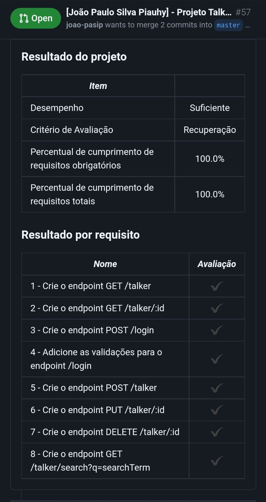

# Projeto Talker Manager

Projeto feito para desenvolver uma API de um `CRUD` (Create, Read, Update e Delete) de palestrantes (talkers) e, também, desenvolver alguns endpoints que irão ler e escrever em um arquivo utilizando o módulo fs. Seguindo os princípios de uma API RESTful.

Além disso existe uma documentação sobre o projeto, a utilização da API, feita com o `Swagger` que pode ser acessada quando o projeto estiver em execução pela rota `http://localhost:3000/doc`.

## 🛠 Habilidades
Node.js - Um motor JavaScript, Node.js - Fluxo Assíncrono, Express - HTTP com Node.js, Express - Middlewares e JOI.

## Execução do projeto

Para rodar esse projeto, basta executar em seu terminal o script `npm run start` e acessar as rotas disponíveis. Lembre-se de instalar as dependências necessárias com `npm install` antes.

## Utilização

- Para clonar o projeto: `git clone git@github.com:joao-pasip/Projeto-TalkerManager.git`.

- Já existe um arquivo `docker-compose.yml` (Disponibilizado pela Trybe). Bastando usar o comando `docker-compose up` para rodar o Node pelo docker.

- `npm start` para rodar a aplicação usando o node.

- Pode utilizar alguma ferramenta cliente de API REST para acessar os endpoints com suas informações. Exemplos: Postman e Insomnia (essa última utilizada durante o desenvolvimento da aplicação).

## Endpoints

- GET `/talker`  retorna o `status 200` e um array com todas as pessoas palestrantes cadastradas.
- GET `/talker/:id` retornar o `status 200` e uma pessoa palestrante com base no id da rota.
- POST `/login` O endpoint deverá receber no corpo da requisição os campos `email` e `password` e retornar um token aleatório de 16 caracteres. Este token será utilizado pelas requisições dos próximos requisitos do projeto..
- POST `/talker` O endpoint deve ser capaz de adicionar uma nova pessoa palestrante ao seu arquivo. (Deve receber um objeto, contendo as propriedades `name`, `age` e o objeto `talk` com suas chaves `watchedAt` e `rate`).
- PUT `/talker/:id` O endpoint deve ser capaz de editar uma pessoa palestrante com base no id da rota, sem alterar o id registrado. (Deve receber no body as mesmas informações da rota `post /talker`).
- DELETE `/talker/:id` para deletar um talker, buscando por id. E, a requisição deve ter o token de autenticação nos headers, no campo authorization
- GET `/talker/search?q=searchTerm` (substituindo `searchTerm` pelo termo que deve ser pesquisado) para pesquisar talkers pelo nome.

- Swagger `/doc` para acessar a documentação da API feita com Swagger.

## Considerações finais

Foi um projeto em que já deu para desenvolver uma API de um `CRUD`, seguindo os princípios de uma API RESTful e, também, desenvolver alguns endpoints que irão ler e escrever em um arquivo utilizando o módulo fs, entendendo o fluxo assíncrono do Node.js. Desta forma, utilizamos o JOI para fazer as devidas validações necessárias para o andamento da aplicação e atentando aos middlewares de validações.

